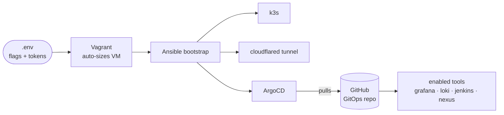
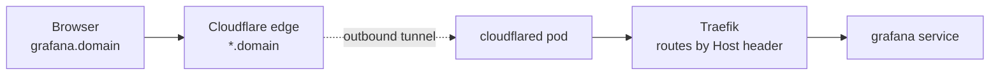
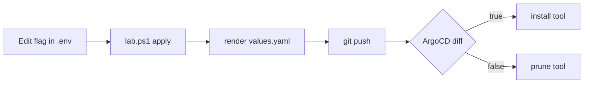

# k3-kube — single-VM DevOps lab

A fully-automated, modular DevOps learning lab on one VMware VM. Toggle tools on/off
from `.env`; ArgoCD installs or prunes them. Every tool is reachable at
`https://<tool>.<your-domain>` — no port-forwarding.




## Prerequisites (one-time, all free for personal use)

1. **VMware Workstation Pro** (free for personal use)
2. **Vagrant** + **Vagrant VMware Utility**, then `vagrant plugin install vagrant-vmware-desktop`
3. **Git for Windows** (helper scripts run via Git Bash)
4. A **Cloudflare** domain + API token (*Zone:DNS:Edit* + *Account:Cloudflare Tunnel:Edit*) + Account ID
5. A **GitHub repo** for this project + a token with `repo` scope

## Quick start

```powershell
Copy-Item .env.example .env   # fill in DOMAIN, CF_*, GIT_*, GITHUB_TOKEN, flags
.\lab.ps1 up                  # boot + bootstrap
.\lab.ps1 status              # VM size, ArgoCD health, tool URLs
```

| Command | Does |
|---|---|
| `up` | boot VM + bootstrap everything |
| `apply` | re-render flags from `.env`, push, reconcile |
| `sync` | force ArgoCD to reconcile now |
| `status` | flags + ArgoCD app health + URLs |
| `plan` | Ansible dry-run |
| `down` | destroy VM |
| `clean-cf` | delete the tunnel + wildcard DNS |

> With `make` (Git Bash/Linux), the same verbs work: `make up`, `make apply`, …

## How requests reach a tool

One wildcard `*.<domain>` covers every tool. The tunnel is **outbound-only** — no public IP.



## How toggling works

Flags live in Git (`values.yaml`); secrets are injected into the cluster by Ansible and
**never committed**.



## VM auto-sizing

Computed from enabled flags — base 4GB/2CPU, +1GB monitoring, +0.5GB Loki, +2GB/+1CPU
each for Jenkins/Nexus — clamped to **4–8GB / 2–4 CPU**. Override via `VM_MEMORY`/`VM_CPUS`
in `.env`. You can't comfortably run all four heavy tools at once — that's the point of toggles.

## First-run notes

- **Pinned Helm chart versions** in `gitops/root/templates/*.yaml` may age out. On a
  `chart not found` sync error, bump that app's `targetRevision`.
- The Cloudflare role creates a locally-managed tunnel named `k3-kube`; re-runs reuse the
  in-cluster credentials. `clean-cf` removes the tunnel + wildcard DNS.
- TLS terminates at Cloudflare's edge; in-cluster traffic to Traefik is plain HTTP.

## License

[Apache License 2.0](LICENSE) © 2026 Xeze-org.
