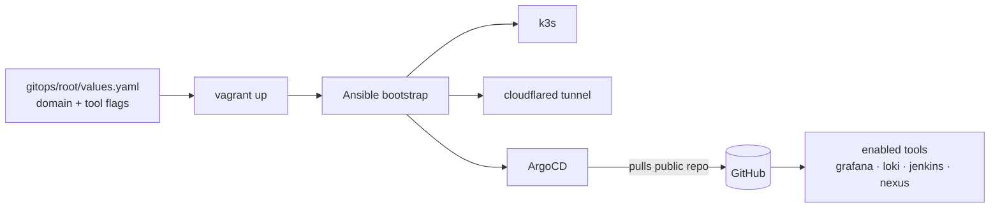

# k3-kube — single-VM DevOps lab


A fully-automated, modular DevOps learning lab on one VMware VM. Toggle tools on/off in
`values.yaml`; ArgoCD installs or prunes them. Every tool is reachable at
`https://<tool>.<your-domain>` via a Cloudflare Tunnel — no port-forwarding, no public IP.

📖 **Docs:** [Prerequisites](docs/prerequisites.md) · [Quick start](docs/quickstart.md) · [Configuration](docs/configuration.md) · [Tools](docs/tools.md) · [Passwords](docs/passwords.md) · [Networking](docs/networking.md) · [VM sizing](docs/vm-sizing.md) · [Troubleshooting](docs/troubleshooting.md)

🧩 **Want to deploy your own app?** Copy the [`example/`](example/) app — manifests + ArgoCD setup, fully explained.

> [!WARNING]
> **Fork this repo first.** Then set `repoURL` (your fork) and `domain` in
> `gitops/root/values.yaml` and push — ArgoCD pulls from **your** repository, not this one.



## Quick start

```powershell
Copy-Item .env.example .env        # fill in CF_API_TOKEN + CF_ACCOUNT_ID
# edit gitops/root/values.yaml (domain + repoURL + tool flags), then:
git add gitops/root/values.yaml; git commit -m "configure lab"; git push
vagrant up
```

Details: [Quick start](docs/quickstart.md) · [Configuration](docs/configuration.md).

## Get your passwords

Username is `admin` for every tool:

```powershell
vagrant ssh -c "bash /vagrant/scripts/passwords.sh"
```

## License

[Apache License 2.0](LICENSE) © 2026 Xeze-org.
