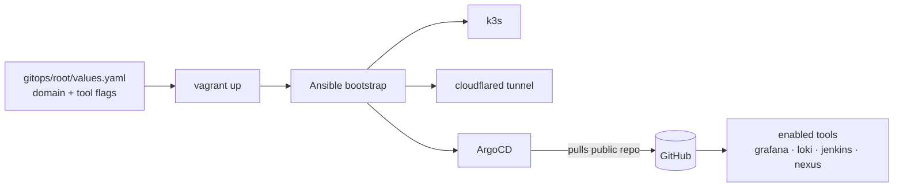
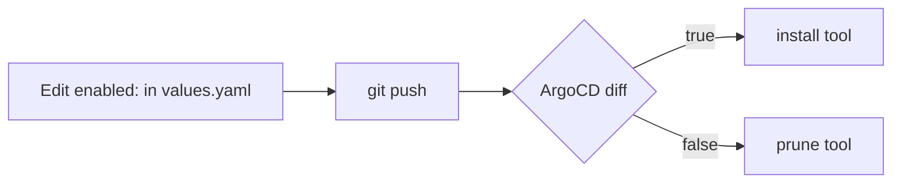
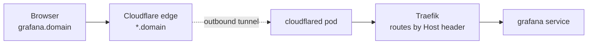

# k3-kube — single-VM DevOps lab

A fully-automated, modular DevOps learning lab on one VMware VM. Toggle tools on/off
in `values.yaml`; ArgoCD installs or prunes them. Every tool is reachable at
`https://<tool>.<your-domain>` via a Cloudflare Tunnel — no port-forwarding, no public IP.

> [!WARNING]
> **After forking this repository, you MUST update `gitops/root/values.yaml` and push the changes to your own repository before running `vagrant up`.**
>
> Update:
> - `repoURL` → your GitHub repository URL
> - `domain` → your own domain
> - Tool flags (`monitoring`, `jenkins`, `nexus`, etc.)
>
> Then commit and push:
>
> ```bash
> git add gitops/root/values.yaml
> git commit -m "Configure my DevOps lab"
> git push
> ```
>
> ArgoCD pulls from **your repository**, not this one.



## Prerequisites (one-time, all free for personal use)

1. **Download & install VMware Workstation Pro** — free for personal use, from
   [Broadcom](https://support.broadcom.com/group/ecx/productdownloads?subfamily=VMware+Workstation+Pro).

2. **Download & install Vagrant** — from
   [developer.hashicorp.com/vagrant/install](https://developer.hashicorp.com/vagrant/install).

3. **Install the Vagrant VMware Utility** — from
   [developer.hashicorp.com/vagrant/install/vmware](https://developer.hashicorp.com/vagrant/install/vmware),
   then install the provider plugin:
   ```powershell
   vagrant plugin install vagrant-vmware-desktop
   ```

4. **Create a Cloudflare API token** at
   [dash.cloudflare.com/profile/api-tokens](https://dash.cloudflare.com/profile/api-tokens) →
   *Create Custom Token*, with these permissions:
   - `Account` · `Cloudflare Tunnel` · `Edit`
   - `Zone` · `DNS` · `Edit`
   - `Zone` · `Zone` · `Read`

   Put it in `.env` as `CF_API_TOKEN`.

5. **Get your Cloudflare Account ID** — in the dashboard, click your domain. The URL becomes:
   ```
   https://dash.cloudflare.com/6a62f1c74965310d79b3fb7f1ac4abde/domain.com
                              └──────────────┬───────────────┘
                                   this middle part = Account ID
   ```
   Copy **only that middle segment** (between the two `/`) into `.env` as `CF_ACCOUNT_ID`.

6. **Create a public GitHub repo** for this project and push it. ArgoCD reads it with
   **no token** (public). Set its URL as `repoURL` in `gitops/root/values.yaml`.

## Quick start

```powershell
# 1. Secrets (gitignored): just the Cloudflare token
Copy-Item .env.example .env        # fill in CF_API_TOKEN + CF_ACCOUNT_ID

# 2. Config: set your domain + which tools you want
#    edit gitops/root/values.yaml, then commit + push so ArgoCD can read it
git add gitops/root/values.yaml; git commit -m "configure lab"; git push

# 3. Boot everything
vagrant up
```

That's it. `vagrant up` reads `values.yaml` (domain, flags, VM sizing) and `.env`
(Cloudflare token), then Ansible bootstraps k3s + ArgoCD + the tunnel. ArgoCD installs
the tools you enabled.

## Everyday commands

```powershell
vagrant up          # boot + bootstrap (or apply provisioning changes)
vagrant ssh         # shell into the VM
vagrant reload      # re-read VM size after toggling heavy tools
vagrant destroy -f  # tear down
```

Optional helper scripts (need Git Bash):

```bash
bash scripts/status.sh     # flags + ArgoCD app health + URLs
bash scripts/check.sh      # curl each enabled tool's URL
bash scripts/clean-cf.sh   # delete the Cloudflare tunnel + wildcard DNS
```

## Toggling a tool



Edit a flag in `gitops/root/values.yaml`, `git push`, and ArgoCD reconciles within
~3 min. If you enable/disable a *heavy* tool (Jenkins/Nexus), run `vagrant reload` so the
VM resizes. To force ArgoCD immediately: `vagrant ssh -c "bash /vagrant/scripts/sync.sh"`.

## How requests reach a tool

One wildcard `*.<domain>` covers every tool. The tunnel is **outbound-only**.



## VM auto-sizing

Computed from the enabled flags in `values.yaml` — base 4GB/4CPU, +1GB monitoring,
+0.5GB Loki, +2GB/+1CPU each for Jenkins/Nexus — clamped to **4–8GB / 4–8 CPU**.
Override with `VM_MEMORY`/`VM_CPUS` in `.env`. You can't comfortably run all four heavy
tools at once — that's the point of toggles.

## First-run notes

- **Pinned Helm chart versions** in `gitops/root/templates/*.yaml` may age out. On a
  `chart not found` sync error, bump that app's `targetRevision`.
- The Cloudflare role creates a tunnel named `k3-kube`; re-runs reuse the in-cluster
  credentials. `scripts/clean-cf.sh` removes the tunnel + wildcard DNS.
- TLS terminates at Cloudflare's edge; in-cluster traffic to Traefik is plain HTTP.

## License

[Apache License 2.0](LICENSE) © 2026 Xeze-org.
