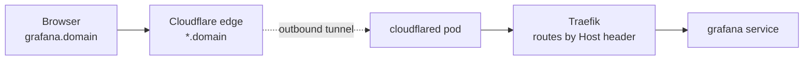

# How requests reach a tool

One wildcard `*.<domain>` covers every tool. The Cloudflare Tunnel is **outbound-only** —
no port-forwarding, no public IP, no inbound firewall holes.

- **TLS terminates at Cloudflare's edge.** In-cluster traffic to Traefik is plain HTTP, so
  Ingress objects don't carry a `tls:` block.
- **Traefik is the ingress controller** (k3s built-in). Ingresses use
  `ingressClassName: traefik` and route by `Host` header.
- The Cloudflare role creates a tunnel named `k3-kube`; re-runs reuse the in-cluster
  credentials. `scripts/clean-cf.sh` removes the tunnel + wildcard DNS.
